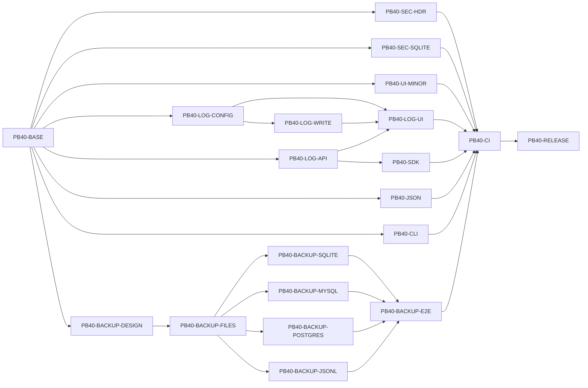

# pocketbase-java 对标 PocketBase v0.40.0 更新开发计划

> - 计划版本：1.0
> - 生成日期：2026-08-24
> - 当前代码基线：`dev` / `997c6761`，对标 PocketBase **v0.39.11**
> - 目标上游版本：PocketBase **v0.40.0**
> - 总体状态：**已完成**
> - 差异输入：[`PocketBase-v0.39.11-to-v0.40.0-Difference-Analysis.md`](PocketBase-v0.39.11-to-v0.40.0-Difference-Analysis.md)

## 一、目标与边界

### 1.1 升级目标

1. 对齐 PocketBase v0.40.0 新增的 REST、设置、日志持久化、安全头和 Admin UI 行为。
2. 将官方 SQLite 备份优化映射为适用于 SQLite、MySQL、PostgreSQL、JSONL 的一致性方案。
3. 用官方 v0.40.0 fixture 验证 Jackson 的外部 JSON 行为，避免 Go JSON v2 升级造成隐性兼容缺口。
4. 在 JVM、GraalVM native、官方 JS SDK 0.28.x 和现有 Dart SDK 上通过发布门禁。
5. 所有 gate 通过后，才把项目对标基线从 v0.39.11 改为 v0.40.0。

### 1.2 非目标

- 不引入 Go 1.27 或 Go `encoding/json/v2`。
- 不为名称对齐而增加无消费者的 `Record.GetInt64`、`Store.Keys` Java API。
- 不把 modernc SQLite 的 `_defensive=1` 原样写入 Xerial JDBC URL。
- 不将官方 Svelte Admin UI 重写进本项目；保留 React 19、现有路由和组件体系。
- 不把对象 key 顺序、上游 `ui/dist` hash、Go 内部类型当成 REST 契约。
- 不改变“使用 S3 collection storage 时，上传文件不进入本地 ZIP 备份”的现有边界。
- 本计划不自动决定 pocketbase-java 自身 Maven 版本号；发布版本由完成时单独确认。

### 1.3 强制工程约束

- API 路径、方法、鉴权和响应必须与官方一致。
- 新文案使用 `t("key", "English default")`，9 个 locale 的 key 集合保持一致。
- 危险操作使用 `ConfirmDialog`，禁止新增 `window.confirm`。
- UI 修改后执行 `cd ui && npm run build` 并提交嵌入资源。
- 设置保存后重新 GET `/api/settings`，不信任 PATCH 原始回显。
- SQLite、MySQL、PostgreSQL、JSONL 不得分别复制一套日志截断语义。
- 备份实现必须先通过设计评审和并发时序测试，不能只修改提示文案。

---

## 二、完成定义（Definition of Done）

只有同时满足以下条件，升级状态才能改为“完成”：

- [x] 官方 v0.40.0 净新增路由已进入 `official-route-manifest.json`，路由一致性测试通过。
- [x] `DELETE /api/logs` 对 401、403、204、设置不变、清空结果和不自记录行为全部通过。
- [x] `logs.maxDataSize` 和 `maxDays/minLevel` 新范围在 relational 与 JSONL 中一致。
- [x] message/data 截断与官方 fixture 一致，`__pb_truncated__` 只在实际截断时出现。
- [x] COOP 与 Content-Disposition 响应头在普通、错误、文件和 HEAD 请求中通过回归。
- [x] Admin UI 可配置限长、确认清空日志、刷新列表/图表并正确展示截断日志。
- [x] 9 个 locale key 集完全一致，UI unit test、build 和 Playwright E2E 通过。
- [x] Java SDK `LogsService.truncate()`、JS SDK 0.28.x smoke、Dart smoke 通过。
- [x] SQLite、MySQL、PostgreSQL 和 JSONL 的备份并发写入/恢复一致性测试通过。
- [x] Jackson v0.40.0 JSON 兼容矩阵通过或每个有意差异均有文档和批准结论。
- [x] JVM 和 native binary 的错误退出码、SIGTERM 与资源清理 smoke 通过。
- [x] GitHub Actions `CI Release Gate` 全绿，嵌入式 Admin UI 无未生成差异。
- [x] README、docs 索引及项目基线最后更新为 v0.40.0。

---

## 三、状态、优先级与估算规则

### 3.1 状态

| 状态 | 含义 |
| --- | --- |
| 已完成 | 尚未修改代码 |
| 设计中 | 正在固化契约或技术方案 |
| 开发中 | 已开始实现，尚未通过全部任务验收 |
| 待验收 | 实现完成，等待矩阵/E2E/hosted CI |
| 已完成 | 本任务的代码、测试、文档和 gate 全部通过 |
| 阻塞 | 有明确外部条件，且记录了解除条件 |

### 3.2 优先级

- **P0**：API、安全、数据一致性或发布阻断。
- **P1**：官方功能对齐和关键回归。
- **P2**：低风险 UI、性能和维护优化。

### 3.3 工时说明

工时以一个熟悉本项目的开发者的“人日”为粗略估算，包含编码、单元测试和本地验收，不包含 hosted runner 排队及外部评审等待。备份和 JSON 任务的不确定性最高，应在 prototype 后重估。

---

## 四、任务总表

| ID | 任务 | 优先级 | 状态 | 依赖 | 估算 |
| --- | --- | --- | --- | --- | ---: |
| PB40-BASE | 冻结官方 v0.40.0 契约与 fixture | P0 | 已完成 | 无 | 1.0–1.5 人日 |
| PB40-SEC-HDR | COOP 与 Content-Disposition 回归 | P0 | 已完成 | PB40-BASE | 0.5–1.0 人日 |
| PB40-SEC-SQLITE | SQLite defensive mode Java 映射 | P1 | 已完成 | PB40-BASE | 1.0–2.0 人日 |
| PB40-LOG-CONFIG | 日志设置模型与范围校正 | P0 | 已完成 | PB40-BASE | 1.0–1.5 人日 |
| PB40-LOG-WRITE | 共享日志截断器与跨引擎写入 | P0 | 已完成 | PB40-LOG-CONFIG | 2.0–3.0 人日 |
| PB40-LOG-API | `DELETE /api/logs` 全存储实现 | P0 | 已完成 | PB40-BASE | 1.0–1.5 人日 |
| PB40-LOG-UI | 日志设置、清空、刷新与摘要 UI | P1 | 已完成 | PB40-LOG-CONFIG、PB40-LOG-WRITE、PB40-LOG-API | 2.0–3.0 人日 |
| PB40-SDK | Java/JS/Dart SDK 验收 | P1 | 已完成 | PB40-LOG-API | 1.0–1.5 人日 |
| PB40-UI-MINOR | select、图表、records 性能小项 | P2 | 已完成 | PB40-BASE | 1.0–1.5 人日 |
| PB40-BACKUP-DESIGN | 在线备份一致性设计与 prototype | P0 | 已完成 | PB40-BASE | 2.0–3.0 人日 |
| PB40-BACKUP-FILES | 文件 generation/journal 与 ZIP 并发保护 | P0 | 已完成 | PB40-BACKUP-DESIGN | 2.0–3.0 人日 |
| PB40-BACKUP-SQLITE | SQLite 一致性在线快照 | P0 | 已完成 | PB40-BACKUP-DESIGN、PB40-BACKUP-FILES | 2.0–3.0 人日 |
| PB40-BACKUP-MYSQL | MySQL consistent snapshot | P0 | 已完成 | PB40-BACKUP-DESIGN、PB40-BACKUP-FILES | 1.5–2.5 人日 |
| PB40-BACKUP-POSTGRES | PostgreSQL repeatable-read snapshot | P0 | 已完成 | PB40-BACKUP-DESIGN、PB40-BACKUP-FILES | 1.5–2.5 人日 |
| PB40-BACKUP-JSONL | JSONL 短锁不可变快照 | P0 | 已完成 | PB40-BACKUP-DESIGN、PB40-BACKUP-FILES | 1.5–2.5 人日 |
| PB40-BACKUP-E2E | 并发备份、恢复和引用完整性矩阵 | P0 | 已完成 | 四个 BACKUP 实现任务 | 2.0–3.0 人日 |
| PB40-JSON | Jackson v0.40.0 兼容矩阵 | P0 | 已完成 | PB40-BASE | 2.0–3.0 人日 |
| PB40-CLI | JVM/native 退出与终止生命周期 | P1 | 已完成 | PB40-BASE | 1.0–2.0 人日 |
| PB40-CI | 扩展四存储发布门禁 | P0 | 已完成 | 所有实现任务 | 1.0–2.0 人日 |
| PB40-RELEASE | 文档、基线和发布收口 | P0 | 已完成 | PB40-CI | 0.5–1.0 人日 |

预计总量：**28–44 人日**（表中原始区间合计为 27.5–44 人日，向上取整用于排期）。单人串行约 6–9 周；在契约冻结后，日志、安全/JSON/CLI、备份可以并行，2–3 人协作约 3–5 周。估算不包含发现驱动不支持 defensive mode 后的依赖升级评审。

---

## 五、依赖关系与建议阶段



建议阶段：

1. **阶段 A：契约冻结** — PB40-BASE。
2. **阶段 B：快速兼容闭环** — SEC-HDR、LOG-CONFIG、LOG-WRITE、LOG-API、SDK；JSON/CLI 同时启动。
3. **阶段 C：Admin UI** — LOG-UI、UI-MINOR，并构建嵌入资源。
4. **阶段 D：备份高风险改造** — DESIGN → FILES → 四引擎 → E2E。
5. **阶段 E：发布收口** — CI → RELEASE。

关键路径通常是 `BASE → BACKUP-DESIGN → BACKUP-FILES → 各引擎 → BACKUP-E2E → CI → RELEASE`。

---

## 六、详细任务

### PB40-BASE：冻结官方契约与 fixture

**优先级 / 状态：** P0 / 待开始
**依赖：** 无
**可并行：** 否；它是其他任务的输入
**涉及位置：**

- `src/test/resources/official-route-manifest.json`（读取当前 v0.39.11 基线，不在本任务提前替换）
- `src/test/java/io/github/jackbaozz/pocketbase/server/RouteConformanceTest.java`
- `src/test/java/io/github/jackbaozz/pocketbase/server/BehaviorFixturesTest.java`
- 建议新增 `src/test/resources/pb-v0.40.0/`

**实施步骤：**

1. 固定官方 tag、commit、Release 和 compare 链接，不追踪移动的 master。
2. 在 `src/test/resources/pb-v0.40.0/` 冻结目标路由 manifest，把 `DELETE /api/logs` 标记为 superuser auth；当前生效的 `official-route-manifest.json` 要等 PB40-LOG-API 实现路由时再同步，保证中间提交不把 CI 置红。
3. 使用官方 v0.40.0 binary 录制最小 fixture：日志清空、settings logs、ASCII/多字节 message、不同 `maxDataSize`、截断 marker、COOP 和文件名。
4. fixture 只保存可观察请求/响应，不复制上游数据库内部结构。
5. 为每个 fixture 写来源、命令、平台和预期；敏感 token 使用测试数据。
6. 在 `BehaviorFixturesTest` 中增加 Java 响应对比入口，忽略动态 id/time，但不忽略状态码、字段和值。

**测试：**

- v0.40.0 target route manifest 包含新端点且无重复 method/path；当前生效 manifest 仍保持与当前代码一致。
- fixture JSON 可被 Jackson 解析，动态字段归一化后可稳定重跑。
- v0.39.11 binary 对新增 fixture 至少出现预期差异，证明 fixture 有区分能力。

**验收标准：**

- 所有后续任务都能引用 fixture 编号，而不是依赖 Release Note 的模糊“characters”等描述。
- tag/commit 与差异报告一致；没有把中间已回滚提交计入范围。

**风险与回滚：** fixture 录制错误会污染全部任务；必须保留原始 curl 命令并由第二次独立运行复核。该任务只新增测试资产，回滚不影响运行时。

**估算：** 1.0–1.5 人日。

### PB40-SEC-HDR：默认安全头和下载名回归

**优先级 / 状态：** P0 / 待开始
**依赖：** PB40-BASE
**可并行：** 可与日志、JSON、CLI 开发并行
**涉及位置：**

- `src/main/java/io/github/jackbaozz/pocketbase/server/internal/HttpApi.java`
- `src/main/java/io/github/jackbaozz/pocketbase/server/internal/HttpFileSupport.java`
- `src/test/java/io/github/jackbaozz/pocketbase/server/LocalPocketBaseServerTest.java`
- 建议新增 `src/test/java/io/github/jackbaozz/pocketbase/server/internal/HttpFileSupportTest.java`

**实施步骤：**

1. 在 `addCommonHeaders()` 增加 `Cross-Origin-Opener-Policy: same-origin`。
2. 确认 header 在 JSON、204、4xx/5xx、Admin UI、文件 GET/HEAD/Range 路径均不会被后续处理移除。
3. 保留现有带双引号 Content-Disposition；集中复核 filename 清理函数。
4. 增加空格、分号、Unicode、引号、反斜杠、CR、LF、`download=1`、inline 和 attachment 用例。
5. 验证恶意 filename 不能产生第二个响应头。

**验收标准：**

- 所有响应的 COOP 值精确为 `same-origin`。
- Content-Disposition 与官方 fixture 一致且不存在 CR/LF 注入。
- HEAD/304/206 不回归，已有 `nosniff`、CSP 和 Range 行为保持不变。

**风险与回滚：** COOP 可能影响依赖 `window.opener` 的跨源自定义页面。官方默认就是隔离；若发现项目自有 OAuth popup 受影响，必须修正 OAuth 通信方式，不能静默移除安全头。单独提交便于回滚定位。

**估算：** 0.5–1.0 人日。

### PB40-SEC-SQLITE：SQLite defensive mode Java 映射

**优先级 / 状态：** P1 / 待开始
**依赖：** PB40-BASE
**可并行：** 可
**涉及位置：**

- `pom.xml`
- `src/main/java/io/github/jackbaozz/pocketbase/server/internal/JooqDatabase.java`
- `src/test/java/io/github/jackbaozz/pocketbase/server/internal/SqlEndpointTest.java`
- 建议新增 `src/test/java/io/github/jackbaozz/pocketbase/server/internal/SqliteDefensiveModeTest.java`

**实施步骤：**

1. 用当前 Xerial 3.46.0.0 做 capability spike，确认是否可调用 `SQLITE_DBCONFIG_DEFENSIVE`；不得假设 URL 参数有效。
2. 若当前驱动有稳定 API，在每个新 SQLite connection 初始化时启用，并读回/用负面 SQL 验证。
3. 若只能升级 Xerial，单独评估 JDBC、native-image、反射配置、CVE 和 CI 后再改 `sqlite.jdbc.version`。
4. 若驱动无能力，评估 authorizer 或受限 SQL endpoint 的等价覆盖，并记录未覆盖的嵌入式 JDBC 直连边界。
5. 验证应用迁移、索引、view、备份恢复和 `/api/sql` 合法操作不受影响。

**验收标准：**

- 测试能证明危险 schema/internal 写入被拒绝，而不是只证明配置语句没报错。
- SQLite 正常建库、迁移和 native smoke 通过。
- MySQL/PostgreSQL 不执行 SQLite 专属设置。

**风险与回滚：** 驱动升级可能破坏 GraalVM native。版本升级必须独立提交；失败时回滚依赖版本并把 defensive 标记为有证据的阻塞项，不允许使用无效参数伪完成。

**估算：** 1.0–2.0 人日，若需升级驱动再重估。

### PB40-LOG-CONFIG：日志设置模型与范围校正

**优先级 / 状态：** P0 / 待开始
**依赖：** PB40-BASE
**可并行：** 可与 LOG-API 并行
**涉及位置：**

- `src/main/java/io/github/jackbaozz/pocketbase/server/internal/repository/SettingsRepository.java`
- `src/main/java/io/github/jackbaozz/pocketbase/server/internal/JsonFileStore.java`
- `src/test/java/io/github/jackbaozz/pocketbase/server/LocalPocketBaseServerTest.java`

**实施步骤：**

1. 在两套默认 settings 中加入 `logs.maxDataSize = 0`，并把官方默认 `logAuthId=false` 用于缺失该字段的配置；已经显式保存的 `true` 必须保留。
2. 新增 long 型规范化/验证，合法范围 `0..9_007_199_254_740_991L`。
3. 把 `maxDays` 从 `0..3650 int` 调整为官方 safe integer 范围，并修改所有消费者使用 long。
4. `minLevel` 允许负数，最大 safe integer；避免 `Number.intValue()` 溢出后错误变号。
5. 清理 cutoff 计算对超大 `maxDays` 做饱和处理：表示“不会因时间过期”，不得抛 `DateTimeException`。
6. 保证旧 settings 缺少 `maxDataSize` 时无迁移失败，GET 自动回显 `0`。
7. PATCH 非数字、负数、超过 safe integer 时返回与项目验证格式一致的 400，而不是静默钳制成另一个值。

**测试：**

- 缺字段、0、1、16384、safe integer 最大值、最大值+1、负数、字符串、浮点数。
- 缺失 `logAuthId` 时默认 false；显式 true/false 在保存和重启后不变。
- `minLevel=-100` 可保存；超大 maxDays 不触发日期溢出。
- SQLite/MySQL/PostgreSQL/JSONL 读取、保存和重启后结果一致。

**验收标准：** settings GET/PATCH fixture 一致；旧数据目录可直接启动；不存在 `int` 截断或 silent clamp。

**风险与回滚：** 放宽 `maxDays` 后旧清理实现可能溢出。设置提交必须与所有读取方测试一起合并；回滚代码时未知 `maxDataSize` 字段仍应被旧版本安全忽略/保留。

**估算：** 1.0–1.5 人日。

### PB40-LOG-WRITE：共享日志截断器与跨引擎写入

**优先级 / 状态：** P0 / 待开始
**依赖：** PB40-LOG-CONFIG
**可并行：** relational 和 JSONL 接入可在共享算法冻结后并行
**涉及位置：**

- 建议新增 `src/main/java/io/github/jackbaozz/pocketbase/server/internal/LogPersistenceSanitizer.java`
- `src/main/java/io/github/jackbaozz/pocketbase/server/internal/repository/LogRepository.java`
- `src/main/java/io/github/jackbaozz/pocketbase/server/internal/JsonFileStore.java`
- 建议新增 `src/test/java/io/github/jackbaozz/pocketbase/server/internal/LogPersistenceSanitizerTest.java`

**实施步骤：**

1. 定义唯一 `sanitize(message, data, maxDataSize)` 入口；两种 store 不再各自实现规则。
2. `maxDataSize=0` 解析成 16,384-byte 预算；空 data 原样保留。
3. 使用 UTF-8 序列化 data；未超限时不得改变值或增加 marker。
4. 超限时通过 Jackson streaming parser 保留预算前可完整解码的顶层属性；遇到半个嵌套值或多字节序列时停止，并加入 `__pb_truncated__=true`。
5. 若原数据已经包含同名 key，按官方 fixture 固定覆盖语义。
6. message 以官方 fixture 固化 ASCII 和多字节边界；Java 输出必须保持合法 JSON/UTF-8。
7. 在 relational insert 与 JSONL append 之前调用 sanitizer；查询、统计和下载不重复截断。
8. 记录截断器自身异常的安全策略：不能因日志失败让业务请求失败，也不能回退保存无限大原值。

**测试：**

- 7,999/8,000/8,001-byte message；CJK、emoji 和恰好切在多字节中间。
- data 为 0、1、默认、恰好阈值、阈值+1、极小阈值、嵌套 map/list、Unicode、error/details。
- marker 只在截断时出现；最终 JSON 可解码。
- 同一输入在 relational 与 JSONL 的持久化结果语义一致。
- 大日志压力测试证明单条行大小受控，业务响应不因 logger 异常失败。

**验收标准：** 全部 PB40-BASE 日志 fixture 通过；两种写入路径仅调用同一 sanitizer；无 OOM 型先复制超大对象链路。

**风险与回滚：** best-effort 解析是高风险边界。先合并纯函数和 fixture，再接入存储；接入可按 store 独立回滚，但不得长期保留两套算法。

**估算：** 2.0–3.0 人日。

### PB40-LOG-API：`DELETE /api/logs` 全存储实现

**优先级 / 状态：** P0 / 待开始
**依赖：** PB40-BASE
**可并行：** 可与 LOG-CONFIG/WRITE 并行
**涉及位置：**

- `src/main/java/io/github/jackbaozz/pocketbase/server/internal/HttpApi.java`
- `src/main/java/io/github/jackbaozz/pocketbase/server/internal/StorageEngine.java`
- `src/main/java/io/github/jackbaozz/pocketbase/server/internal/RelationalStorageEngine.java`
- `src/main/java/io/github/jackbaozz/pocketbase/server/internal/repository/LogRepository.java`
- `src/main/java/io/github/jackbaozz/pocketbase/server/internal/JsonFileStore.java`
- `src/test/resources/official-route-manifest.json`
- `src/test/java/io/github/jackbaozz/pocketbase/server/LocalPocketBaseServerTest.java`

**实施步骤：**

1. 注册并 dispatch `DELETE /api/logs`，继续复用 `requireSuperuser()`。
2. 在 `StorageEngine` 增加 `truncateLogs()`；relational 直接删除 `_logs` 全部行，JSONL 清空内存并原子持久化空文件。
3. 删除成功返回无 body 的 204；不存在日志时仍幂等返回 204。
4. 不调用逐条 model/event hook，不修改 `logs.maxDays` 或其他 settings。
5. 官方 vacuum 针对独立 auxiliary logs DB；Java 当前把日志放在主业务数据库，不能在 DELETE 请求里机械执行可能长时间锁库的 full `VACUUM`。先评估安全的异步/增量 compact；无安全方案时只完成删除。任何可选 compact 失败都只记 warning，MySQL/PostgreSQL 也不得因缺少 OPTIMIZE/VACUUM 权限把 204 改为 500。
6. 保持 `shouldLogActivity()` 对成功 logs route 的跳过，错误请求仍可记录。

**测试：**

- 401、403、204；0 条、1 条、多条；重复 DELETE。
- 删除后 list/stats 为 0，原 `maxDays` 不变。
- 成功 DELETE 不新建 activity log。
- 若启用可选 compact，模拟 compact 失败时数据已删除且 API 仍 204；未启用时验证 DELETE 不触发主库 full vacuum。
- SQLite、MySQL、PostgreSQL、JSONL 全部执行。

**验收标准：** 状态码、body、鉴权和副作用与官方 fixture 一致；RouteConformanceTest 通过。

**风险与回滚：** 这是不可恢复的管理操作。API 只提供官方要求的 superuser 鉴权，不增加普通用户入口；UI 另加明确确认。实现提交应包含完整测试，必要时整体回滚端点。

**估算：** 1.0–1.5 人日。

### PB40-LOG-UI：日志设置、清空、刷新与摘要

**优先级 / 状态：** P1 / 待开始
**依赖：** PB40-LOG-CONFIG、PB40-LOG-WRITE、PB40-LOG-API
**可并行：** locale 翻译可在 key 冻结后并行
**涉及位置：**

- `ui/src/App.tsx`
- `ui/src/styles.css`
- `ui/src/components/ConfirmDialog.tsx`（复用，不重复实现）
- `ui/src/i18n/locales/{de,en,es,fr,ja,pt,ru,zh_CN,zh_TW}.json`
- `src/test/java/io/github/jackbaozz/pocketbase/server/AdminUiPlaywrightTest.java`
- 构建产物 `src/main/resources/pocketbase-admin/`

**实施步骤：**

1. 在 Logs settings 增加 `maxDataSize` number input，0 显示默认约 16 KiB 的说明，范围与服务端一致。
2. 修正 `maxDays=0` 帮助文案：删除现有日志并禁用持久化；把 `minLevel` 输入范围对齐 `-100..100`。
3. 增加删除按钮和 pending 状态；调用统一 `confirm()`/`ConfirmDialog`，文案明确“删除全部日志”。
4. 确认后发送 DELETE；成功时清空选择、关闭已不存在的详情、重置 list/stats/图表，再重新拉取服务端。
5. 删除失败保持 modal 和当前数据，显示 API 错误，允许重试。
6. `logDataChips()` 对普通数据跳过 `__pb_truncated__`，LogDetailsDrawer 仍展示该标记。
7. 默认日志级别按数值稳定顺序 `-4,0,4,8`；不要依赖对象插入顺序。
8. 更新备份 warning 之前检查 PB40-BACKUP-E2E；在线备份未完成时保留当前诚实文案。
9. 补齐 9 个 locale，运行 key 集一致性检查。
10. 构建 UI 并提交新嵌入资源。

**E2E：**

- 键盘打开设置、修改 maxDataSize、保存后重新 GET 回显。
- Escape/取消不删除；确认删除只发一个 DELETE。
- pending 时按钮禁用；成功后列表和图表为空；失败后状态恢复。
- marker 不出现在列表 chip，详情和导出 JSON 中仍存在。
- 中文/英文基本截图与焦点顺序无回归。

**验收标准：** unit/build/Playwright 通过；9 locale key 完全一致；嵌入资源与 `npm run build` 结果无 diff。

**风险与回滚：** 删除为不可逆操作，必须保留确认和 loading 防重复提交。UI 可单独回滚，但后端官方 API 仍应保留。

**估算：** 2.0–3.0 人日。

### PB40-SDK：Java、JS 与 Dart SDK 验收

**优先级 / 状态：** P1 / 待开始
**依赖：** PB40-LOG-API
**可并行：** Java SDK 和 smoke fixture 可并行
**涉及位置：**

- `src/main/java/io/github/jackbaozz/pocketbase/client/LogsService.java`
- `src/test/java/io/github/jackbaozz/pocketbase/client/PocketBaseClientTest.java`
- `src/test/resources/js-sdk-smoke/package.json`
- `src/test/resources/js-sdk-smoke/package-lock.json`
- `src/test/resources/js-sdk-smoke/smoke.js`
- `src/test/resources/dart-sdk-smoke/`
- `src/test/java/io/github/jackbaozz/pocketbase/server/JsSdkSmokeTest.java`
- `src/test/java/io/github/jackbaozz/pocketbase/server/DartSdkSmokeTest.java`

**实施步骤：**

1. Java `LogsService` 新增 `void truncate()` 或明确的 no-content 返回类型，发送 DELETE `/api/logs`。
2. Java client mock 记录 method/path/auth，并断言无请求 body。
3. 将 JS smoke 的 `pocketbase` 从 0.27.0 锁定升级到官方 Admin UI 使用的 0.28.x；使用 lockfile 精确版本。
4. 在 JS smoke 中创建日志、调用 `pb.logs.truncate()`、确认 list 为空。
5. Dart SDK未因本次发布声明升级版本；保留当前依赖，但重跑现有 CRUD/file/batch/realtime smoke，确保服务变更无回归。
6. CI 中 Dart 缺失必须失败，不能 skip。

**验收标准：** Java、JS 0.28.x、Dart smoke 均真实执行并通过；Authorization、DELETE method 和 204 处理正确。

**风险与回滚：** SDK lockfile 升级可能包含额外行为变化；独立提交依赖升级并保留旧 fixture 结果用于对比。不得把 React UI强行改为依赖 JS SDK。

**估算：** 1.0–1.5 人日。

### PB40-UI-MINOR：select、图表与 records 性能审计

**优先级 / 状态：** P2 / 待开始
**依赖：** PB40-BASE
**可并行：** 可
**涉及位置：**

- `ui/src/components/DropdownSelect.tsx`
- `ui/src/styles.css`
- `ui/src/App.tsx`
- `src/test/java/io/github/jackbaozz/pocketbase/server/AdminUiPlaywrightTest.java`

**实施步骤：**

1. 审计 `DropdownSelect` 的 root/trigger `name`、form、label、错误定位和自定义 class 行为。
2. 以 React 受控组件和 ARIA combobox/listbox 语义为准；只有测试证明需要时才改变 DOM，不直接改成 Svelte 的 `output`。
3. 为日志图表测试 `translateZ(0)`：记录滚动/缩放流畅度和截图清晰度，确认无提升则不合入。
4. records 当前已不带 `fields`。增加有/无 fields 的 Java 响应耗时与传输量基准，不改 REST 契约。
5. 对 50、500、2,000 条含 relation expand 的记录测量，记录结论和阈值。

**验收标准：** select 键盘、label、error focus 和 class 测试通过；records 不出现性能回退超过约定阈值；任何“不修改”结论都有测量证据。

**风险与回滚：** DOM 语义修改可能影响现有 CSS。小项按独立提交处理，可单独回滚，不能阻塞 P0 日志功能，除非发现可访问性缺陷。

**估算：** 1.0–1.5 人日。

### PB40-BACKUP-DESIGN：一致性设计与 prototype

**优先级 / 状态：** P0 / 待开始
**依赖：** PB40-BASE
**可并行：** prototype 可按引擎并行，但设计结论必须统一
**涉及位置：**

- `src/main/java/io/github/jackbaozz/pocketbase/server/internal/repository/BackupRepository.java`
- `src/main/java/io/github/jackbaozz/pocketbase/server/internal/JsonFileStore.java`
- `src/main/java/io/github/jackbaozz/pocketbase/server/internal/JooqDatabase.java`
- `src/main/java/io/github/jackbaozz/pocketbase/server/spi/FileStorageProvider.java`
- 建议产出 `docs/PocketBase-v0.40.0-Backup-Consistency-Design.md`

**实施步骤：**

1. 画出记录事务、collection/schema 变更、文件 put/delete、数据库 snapshot、ZIP entry 和 restore 的时序图。
2. 定义 snapshot cut：数据库中在 cut 前已提交的引用必须在 ZIP 中可恢复；cut 后新增文件不得混入旧数据库状态。
3. 明确可接受边界：允许 ZIP 有未引用的冗余文件，不允许数据库引用缺失文件。
4. 评估并记录四引擎方案、隔离级别、并发 DDL/schema 变更、连接池影响、临时磁盘、取消、超时和 crash cleanup。
5. 对 SQLite JDBC backup API、MySQL consistent snapshot、PostgreSQL repeatable read、JSONL immutable snapshot 各做最小 prototype。
6. 定义统一 `BackupSnapshotStrategy` 和文件 journal 接口，避免继续把分支堆进 `BackupRepository`。
7. 定义 backup manifest/format 兼容：新版本仍能恢复现有 `pocketbase-java-relational-backup-v1`，升级格式需显式 version。
8. 设计临时 fallback（例如内部 feature flag）仅用于紧急回滚，不作为默认长期路径。

**设计验收：**

- 每个引擎都有明确 BEGIN/COMMIT/ROLLBACK 和连接生命周期。
- 恢复兼容、S3 边界、磁盘空间、取消和故障清理都有结论。
- 并发时序能解释“删除前复制”和“cut 后新增排除”。
- prototype 给出锁持续时间和恢复验证，不只给 API 调研结论。

**风险与回滚：** 未完成设计就编码会放大数据风险。本任务是硬 gate；若某外部数据库无法在现有逻辑 dump 格式中实现一致快照，应阻塞相应实现，而不是降低验收标准。

**估算：** 2.0–3.0 人日，完成后重估后续备份任务。

### PB40-BACKUP-FILES：文件 generation/journal 与 ZIP 并发保护

**优先级 / 状态：** P0 / 待开始
**依赖：** PB40-BACKUP-DESIGN
**可并行：** 否；四引擎共用
**涉及位置：**

- `src/main/java/io/github/jackbaozz/pocketbase/server/spi/FileStorageProvider.java`
- `src/main/java/io/github/jackbaozz/pocketbase/server/internal/storage/LocalFileStorageProvider.java`
- `src/main/java/io/github/jackbaozz/pocketbase/server/internal/storage/S3FileStorageProvider.java`
- `src/main/java/io/github/jackbaozz/pocketbase/server/internal/repository/FileRepository.java`
- `src/main/java/io/github/jackbaozz/pocketbase/server/internal/repository/BackupRepository.java`
- 建议新增 `internal/backup/FileGenerationJournal.java`

**实施步骤：**

1. 提供仅内部使用、可关闭的 before-delete/before-write observer；所有本地文件变更入口必须统一经过。
2. backup 开始时创建 generation，保存 cut 前删除文件的可读句柄/临时副本。
3. database snapshot 完成后切换 generation，记录 cut 后新文件并从本次 ZIP 排除。
4. ZIP entry 写入使用单一串行 writer 或显式 mutex；close 后 hook 必须立即停止且不能继续写。
5. listener unregister、异常、取消、超时和 JVM shutdown 均清理 journal/临时文件。
6. S3 provider 保持事件 API兼容，但 collection S3 文件不进入本地 ZIP；不得为此把整个 bucket 下载下来。
7. 防止路径穿越、符号链接和重复 ZIP entry。

**测试：**

- 写入/删除 observer 顺序、注销、重复关闭、异常传播。
- 备份与并发文件删除/创建交错 100+ 次，无 duplicate entry、closed writer 或损坏 ZIP。
- 取消后无临时文件和 listener 泄漏。
- 恶意 key 不能逃出 storage prefix。

**验收标准：** ZIP 可被标准工具完整校验；数据库引用文件不缺失；cut 后新增文件不混入；S3 边界保持。

**风险与回滚：** observer 若漏接入口会制造假一致性。通过集中 provider wrapper 减少漏点；旧备份写入器保留到 E2E 完成后再删除。

**估算：** 2.0–3.0 人日。

### PB40-BACKUP-SQLITE：SQLite 一致性在线快照

**优先级 / 状态：** P0 / 待开始
**依赖：** PB40-BACKUP-DESIGN、PB40-BACKUP-FILES
**可并行：** 可与其他引擎任务并行
**涉及位置：**

- `src/main/java/io/github/jackbaozz/pocketbase/server/internal/JooqDatabase.java`
- `src/main/java/io/github/jackbaozz/pocketbase/server/internal/repository/BackupRepository.java`
- 建议新增 `internal/backup/SqliteBackupSnapshotStrategy.java`

**实施步骤：**

1. 使用 prototype 选定 Xerial online backup、受控 read transaction 或安全文件快照；不能直接复制 modernc DSN。
2. 只在产生一致 copy 的短窗口占用必要锁，不在 ZIP 生成期间持有业务事务。
3. 快照写入临时私有文件或流；完成后立即释放 connection，再压缩。
4. 正确处理 WAL/SHM、busy timeout、磁盘不足、取消和异常清理。
5. 保持现有逻辑 backup restore 格式兼容，或提供 versioned reader。

**验收标准：** 并发写入不中断或仅在有界短窗口等待；恢复后 schema/记录/索引/文件一致；临时快照权限为私有；native image 可执行。

**风险与回滚：** SQLite backup API 与 native-image 可能有 JNI 约束。独立策略类和 feature fallback 允许回滚到旧实现，但不能在最终 v0.40.0 完成状态下默认使用长期锁方案。

**估算：** 2.0–3.0 人日。

### PB40-BACKUP-MYSQL：MySQL consistent snapshot

**优先级 / 状态：** P0 / 待开始
**依赖：** PB40-BACKUP-DESIGN、PB40-BACKUP-FILES
**可并行：** 可
**涉及位置：**

- `src/main/java/io/github/jackbaozz/pocketbase/server/internal/repository/BackupRepository.java`
- `src/main/java/io/github/jackbaozz/pocketbase/server/internal/JooqDatabase.java`
- 建议新增 `internal/backup/MysqlBackupSnapshotStrategy.java`

**实施步骤：**

1. 从连接池独占一个 connection，关闭 auto-commit，以 consistent snapshot/read-only 事务开始。
2. 在同一 connection 中读取 metadata、DDL 和所有表；禁止表读取间归还连接。
3. 固化 metadata 列表和 row stream 的时间点；对事务快照无法覆盖的并发 DDL 使用短时 schema guard 或变更检测，处理 view/index 读取。
4. 流式写逻辑 snapshot，避免将大库全部放入 heap。
5. 成功 commit/rollback 后归还连接；异常不得污染 Hikari connection 状态。

**验收标准：** Testcontainers MySQL 下并发跨表事务不会恢复出一半新一半旧；连接池状态恢复；大表测试 heap 有界。

**风险与回滚：** 非事务表不能保证 consistent snapshot。启动/备份时检测并明确报错或记录不支持，不能默默声称一致。

**估算：** 1.5–2.5 人日。

### PB40-BACKUP-POSTGRES：PostgreSQL repeatable-read snapshot

**优先级 / 状态：** P0 / 待开始
**依赖：** PB40-BACKUP-DESIGN、PB40-BACKUP-FILES
**可并行：** 可
**涉及位置：**

- `src/main/java/io/github/jackbaozz/pocketbase/server/internal/repository/BackupRepository.java`
- `src/main/java/io/github/jackbaozz/pocketbase/server/internal/JooqDatabase.java`
- 建议新增 `internal/backup/PostgresBackupSnapshotStrategy.java`

**实施步骤：**

1. 用同一 connection 开启 `REPEATABLE READ READ ONLY` 事务，再读取 schema metadata 与 rows。
2. 明确 statement timeout 对长备份的影响；为备份连接设置受控 timeout，结束后恢复。
3. 流式 fetch，避免大结果一次性 materialize。
4. 处理 quoted identifier、schema、view/index 和 sequence/identity 恢复。
5. commit/rollback 并恢复 connection 隔离级别、readOnly 和 autoCommit。

**验收标准：** Testcontainers PostgreSQL 下所有表来自同一 snapshot；恢复后 sequence 可继续写入；无 idle-in-transaction 泄漏。

**风险与回滚：** 当前连接默认 statement timeout 30 秒，真实备份可能超时。只在专用连接有界调整，不能放宽全局业务查询限制。

**估算：** 1.5–2.5 人日。

### PB40-BACKUP-JSONL：JSONL 短锁不可变快照

**优先级 / 状态：** P0 / 待开始
**依赖：** PB40-BACKUP-DESIGN、PB40-BACKUP-FILES
**可并行：** 可
**涉及位置：**

- `src/main/java/io/github/jackbaozz/pocketbase/server/internal/JsonFileStore.java`
- 建议新增 `src/test/java/io/github/jackbaozz/pocketbase/server/internal/JsonFileStoreBackupConcurrencyTest.java`

**实施步骤：**

1. 在短 synchronized 区间完成 save/flush，并复制不可变文件清单或 hard-link/copy-on-write snapshot。
2. 退出锁后生成 ZIP，业务操作不再等待完整压缩过程。
3. 与 FileGenerationJournal 共享 cut 定义，避免数据 JSON 与 storage 文件跨代。
4. 排除 backups/temp 目录，保持符号链接和路径安全检查。
5. 异常和取消时只删除本次临时 snapshot，不触碰在线 JSONL 数据。

**验收标准：** 人工放慢 ZIP 后，CRUD 仍可在限定延迟内完成；恢复内容来自单一 cut；无半写 JSONL 或缺文件。

**风险与回滚：** hard link 在跨文件系统或 Windows 上不可用。实现需有 copy fallback，并纳入三平台 native release smoke 的文件语义检查。

**估算：** 1.5–2.5 人日。

### PB40-BACKUP-E2E：并发备份和恢复矩阵

**优先级 / 状态：** P0 / 待开始
**依赖：** BACKUP-FILES、SQLITE、MYSQL、POSTGRES、JSONL
**可并行：** 测试场景可先写，最终验收需等待全部实现
**涉及位置：**

- 建议新增 `src/test/java/io/github/jackbaozz/pocketbase/server/BackupConsistencyTest.java`
- `src/test/java/io/github/jackbaozz/pocketbase/server/TestDatabaseFactory.java`
- `src/test/java/io/github/jackbaozz/pocketbase/server/S3BackupRepositoryTest.java`
- `.github/workflows/ci.yml`

**场景矩阵：**

1. 备份期间持续创建/更新/删除两张有关联的表。
2. 记录事务提交前后与 snapshot cut 交错，并覆盖 collection/schema 变更与 snapshot 交错。
3. 上传文件后创建记录、更新替换文件、删除记录并删文件。
4. before-delete、after-cut-new-file 与 ZIP close 交错。
5. 取消、磁盘不足、ZIP writer 失败、数据库 snapshot 失败。
6. 备份生成后恢复到干净目录，逐条验证关系、索引、settings、日志和文件内容/hash。
7. collection storage=S3 时确认本地 ZIP 不包含远程对象，并显示明确提示。

**量化验收：**

- 每个存储模式至少 50 次随机交错运行，无损坏 ZIP、missing referenced file 或跨表半提交。
- ZIP 可通过 `ZipFile` 全 entry CRC 读取。
- 放慢 ZIP 至至少 5 秒时，数据库业务写入不被全程阻塞；允许的 P95 延迟阈值在设计文档中固定。
- 测试结束无活动 listener、未关闭连接、临时文件或 backup guard 残留。

**风险与回滚：** 并发测试本身可能 flaky。使用 latch/barrier 固定关键交错，随机压力只作为补充；CI 失败输出 seed 和阶段，确保可重现。

**估算：** 2.0–3.0 人日。

### PB40-JSON：Jackson v0.40.0 兼容矩阵

**优先级 / 状态：** P0 / 待开始
**依赖：** PB40-BASE
**可并行：** 可
**涉及位置：**

- `src/main/java/io/github/jackbaozz/pocketbase/server/internal/RuntimeJson.java`
- API 中现有 Jackson `ObjectMapper` 使用点
- 建议新增 `src/test/java/io/github/jackbaozz/pocketbase/server/JsonV040CompatibilityTest.java`
- 建议新增 `src/test/resources/pb-v0.40.0/json/`

**矩阵：**

- `null`、空数组、空对象、缺失字段；
- 重复 key、大小写近似字段、尾随空白/尾随垃圾；
- `-1`、`0`、浮点、科学计数、`2^53-1`、`2^53`、long 边界；
- 嵌套 JSON、数组、多字节 Unicode、转义和非法 UTF-8；
- collection import/export、settings、batch、realtime、OAuth2、日志 data；
- fields 投影、错误响应和 deterministic 需求点。

**实施步骤：**

1. 对官方 binary 和 Java 服务发送相同 raw bytes，保存 status、content-type 和语义 JSON。
2. 分类为“必须一致”“非契约顺序差异”“Java 安全增强”“确认的不适用”。
3. 只在差异影响官方 SDK 或 API 语义时调整 `RuntimeJson`；避免全局宽松配置放大攻击面。
4. 大整数设置使用 long/BigInteger 明确解析，不让 double 中转丢精度。
5. 将关键 fixture 加入 JS/Dart smoke 或 server integration test。

**验收标准：** 所有必须一致项通过；对象 key 顺序不做断言；每个有意差异有理由、影响和测试。

**风险与回滚：** 全局 ObjectMapper 开关影响面极大。每项行为使用最小作用域配置；Jackson 版本升级若非必要不与本任务混合。

**估算：** 2.0–3.0 人日。

### PB40-CLI：JVM/native 退出与 terminate 生命周期

**优先级 / 状态：** P1 / 待开始
**依赖：** PB40-BASE
**可并行：** 可
**涉及位置：**

- `src/main/java/io/github/jackbaozz/pocketbase/server/PocketBaseServer.java`
- `src/main/java/io/github/jackbaozz/pocketbase/server/LocalPocketBase.java`
- `src/main/java/io/github/jackbaozz/pocketbase/server/ServerConfig.java`
- `src/test/java/io/github/jackbaozz/pocketbase/server/ServerConfigTest.java`
- 建议新增 `src/test/java/io/github/jackbaozz/pocketbase/server/PocketBaseServerProcessTest.java`
- `scripts/native-sqlite-smoke.sh`

**实施步骤：**

1. 用真实 `ProcessBuilder` 测试未知命令、坏配置、端口占用、启动异常的退出码和 stderr。
2. 明确 main 的顶层错误处理：错误只打印一次并非零退出，不把敏感配置写入日志。
3. 确保 LocalPocketBase 启动中途失败时关闭已创建 store、Hikari pool、executor 和临时资源。
4. 对已启动 JVM 发送 SIGTERM，验证 shutdown hook、端口释放和超时。
5. 在 native smoke 重复未知参数和 SIGTERM 场景；Windows 使用可等价执行的进程终止测试。
6. 避免引入 `System.exit()` 到可嵌入 API 路径；仅 CLI main 决定进程码。

**验收标准：** 所有命令失败 exit code 非 0；正常 help/受控退出为 0；SIGTERM 在约定超时内释放端口和数据库；JVM/native 一致。

**风险与回滚：** `System.exit()` 会破坏单元测试和嵌入使用。进程测试在 forked JVM 中运行；生命周期改动独立提交并保留 `LocalPocketBase` 无进程副作用。

**估算：** 1.0–2.0 人日。

### PB40-CI：四存储发布门禁

**优先级 / 状态：** P0 / 待开始
**依赖：** 所有实现与专项 E2E 任务
**可并行：** 可提前准备 YAML，最终启用需等待测试稳定
**涉及位置：**

- `.github/workflows/ci.yml`
- `.github/workflows/native-release.yml`
- `pom.xml`
- `scripts/native-sqlite-smoke.sh`

**实施步骤：**

1. JVM storage matrix 扩为 `sqlite/mysql/postgresql/jsonl`；external driver profile 只用于 MySQL/PostgreSQL。
2. 确保备份并发、日志契约、JSON fixture 在四个 lane 真实执行。
3. JS SDK 0.28 和 Dart smoke 至少在 SQLite contract lane 必跑；Dart 不存在时失败。
4. UI job 执行 unit test、build，并用 `git diff --exit-code -- src/main/resources/pocketbase-admin` 检查资源同步。
5. Admin UI Playwright 覆盖清空日志和设置；保持 SQLite 独立 E2E lane。
6. native job 在所有 JVM/UI gate 后执行 SQLite health、日志、备份、CLI 生命周期 smoke。
7. 评估 release workflow 三平台产物的 CLI smoke；至少 Linux hosted gate 必跑，macOS/Windows release 构建保留。
8. 为确定性并发测试保留 seed；禁止用无界 retry 掩盖失败。

**必须通过的命令：**

```bash
cd ui && npm test && npm run build
cd ..
mvn -B test -Dstorage=sqlite -DrequireDartSdkSmoke=true -Dtest='!AdminUiPlaywrightTest'
mvn -B test -Dstorage=jsonl -DrequireDartSdkSmoke=true -Dtest='!AdminUiPlaywrightTest'
mvn -B test -Pexternal-db-drivers -Dstorage=mysql -Dtest='!AdminUiPlaywrightTest'
mvn -B test -Pexternal-db-drivers -Dstorage=postgresql -Dtest='!AdminUiPlaywrightTest'
mvn -B -Dstorage=sqlite -Dtest=AdminUiPlaywrightTest test
mvn -Pnative -DskipTests package
bash scripts/native-sqlite-smoke.sh ./target/pocketbase-java
```

**验收标准：** hosted `CI Release Gate` 的四存储、UI、Playwright、native 全绿；失败 job 可重现；没有 skip 掩盖 Dart/native/backup gate。

**风险与回滚：** matrix 增大会拉长 CI。先按测试层分组和缓存优化，不能通过删除关键引擎 lane 缩短时间。flaky 测试必须修复根因或用确定性 barrier 替代随机等待。

**估算：** 1.0–2.0 人日。

### PB40-RELEASE：文档、基线与发布收口

**优先级 / 状态：** P0 / 待开始
**依赖：** PB40-CI 全部通过
**可并行：** 否
**涉及位置：**

- `README.md`
- `README_zh.md`
- `docs/README.md`
- `AGENTS.md`
- 本差异报告与开发计划
- `src/test/resources/official-route-manifest.json`
- 如需发版：`pom.xml`、`ui/package.json`、`sh/bump-version.sh`

**实施步骤：**

1. 回查任务总表和 DoD，每个“已完成”附测试/CI证据。
2. 将当前基线说明从 v0.39.11 更新为 v0.40.0；历史 v0.39.x 文档仍保留历史标签。
3. README API 表加入 `DELETE /api/logs`，说明 `maxDataSize`、备份性能及 S3 文件边界。
4. 更新本计划状态、实际提交和最终 hosted Actions 链接。
5. 运行全量 diff/path/link 检查；确认无本地配置、pb_data、临时备份或 secret 被跟踪。
6. 如用户决定发版，再单独 bump pocketbase-java 版本、生成 changelog/tag，并执行 Native Release Build。

**验收标准：** 文档不再把未完成项写成已完成；main/dev 目标分支策略由用户确认后执行；release gate 链接和 commit 可追溯。

**风险与回滚：** 提前改基线会造成虚假兼容声明，因此该任务必须最后执行。若 CI 回归，恢复 v0.39.11 基线声明并重新打开对应任务。

**估算：** 0.5–1.0 人日。

---

## 七、测试覆盖总矩阵

| 能力 | SQLite | MySQL | PostgreSQL | JSONL | JVM | Native | Admin UI | JS SDK | Dart SDK |
| --- | :---: | :---: | :---: | :---: | :---: | :---: | :---: | :---: | :---: |
| DELETE logs | ✓ | ✓ | ✓ | ✓ | ✓ | ✓ | ✓ | ✓ | — |
| maxDataSize/settings | ✓ | ✓ | ✓ | ✓ | ✓ | ✓ | ✓ | — | — |
| message/data 截断 | ✓ | ✓ | ✓ | ✓ | ✓ | ✓ smoke | ✓ 摘要 | ✓ list | ✓ list |
| COOP/filename | ✓ | 同 HTTP | 同 HTTP | 同 HTTP | ✓ | ✓ | ✓ | — | — |
| 在线备份一致性 | ✓ | ✓ | ✓ | ✓ | ✓ | ✓ SQLite | ✓ 操作 | — | — |
| JSON v0.40 fixture | ✓ | ✓ 关键项 | ✓ 关键项 | ✓ | ✓ | ✓ smoke | 间接 | ✓ | ✓ |
| CLI exit/terminate | — | — | — | — | ✓ | ✓ | — | — | — |

“✓ smoke”只表示 native 快速路径，不能替代 JVM 四引擎完整集成测试。

---

## 八、提交拆分建议

为降低回滚和 review 风险，建议至少按下列顺序拆分提交：

1. `test(parity): freeze PocketBase v0.40.0 contracts`
2. `feat(security): align v0.40 response headers`
3. `feat(logs): add v0.40 log settings and truncation`
4. `feat(logs): add superuser log truncate endpoint`
5. `feat(sdk): support log truncation clients`
6. `feat(ui): align v0.40 log management`
7. `feat(backup): add file generation journal`
8. `feat(backup): add consistent relational snapshots`
9. `feat(backup): add nonblocking JSONL snapshots`
10. `test(backup): add concurrent restore consistency matrix`
11. `test(parity): add v0.40 JSON and CLI gates`
12. `ci: enforce PocketBase v0.40 release gates`
13. `docs: mark PocketBase v0.40.0 parity complete`（仅在全部 gate 通过后）

不要把备份、日志、依赖升级、UI build 产物和文档基线压成一个不可审查的大提交。

---

## 九、进度更新规则

每完成一个任务，应同时更新：

1. 任务总表的状态；
2. 对应详细任务中的实际实现文件；
3. 实际执行的测试命令和结果；
4. commit id；
5. 若涉及 CI，记录 run 链接；
6. 若结论与计划不同，记录原因和新的 Java 映射边界。

建议追加格式：

```markdown
**完成记录（YYYY-MM-DD）：**

- Commit: `<sha>`
- Tests: `<command>` — passed
- CI: `<url>`
- Deviation: 无 / <说明>
```

> 当前所有开发任务均为“待开始”。本计划本身完成只代表升级工作已被拆解，不代表 pocketbase-java 已对标 PocketBase v0.40.0。
