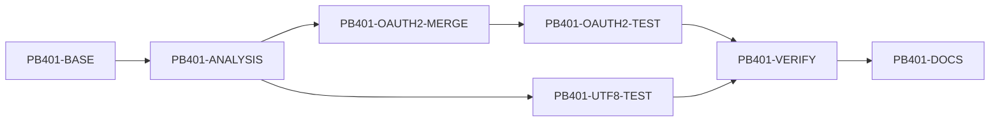

# RPD：PocketBase v0.40.1 兼容性开发计划

> - 计划版本：1.0
> - 创建日期：2026-08-28
> - 项目基线：`dev` / `5481457`（pocketbase-java `v0.4.0`，对标 PocketBase v0.40.0）
> - 目标上游版本：PocketBase **v0.40.1**
> - 总体状态：**已完成**
> - 上游依据：[v0.40.1 release](https://github.com/pocketbase/pocketbase/releases/tag/v0.40.1)、[v0.40.0...v0.40.1 compare](https://github.com/pocketbase/pocketbase/compare/v0.40.0...v0.40.1)、[#7814](https://github.com/pocketbase/pocketbase/issues/7814)、[#7815](https://github.com/pocketbase/pocketbase/issues/7815)

## 1. 目标和边界

本计划只处理 PocketBase v0.40.0 → v0.40.1 的 **7 个提交、26 个文件**的净行为差异。目标是让官方 JS/Dart SDK 对集合 OAuth2 配置的编辑不丢失已有配置，并保证含不合法 UTF-8 来源数据时 REST JSON 响应始终完整、可解析。

本项目是 Java 实现，不复制 Go 的 `encoding/json/v2` 或 Go 1.27 升级；以公开 HTTP 契约和持久化结果为验收对象。v0.40.0 已完成的日志、备份、安全头和 Admin UI 工作不在本次重做范围内。

### 非目标

- 不改动 REST 路由、请求参数、响应结构或 Admin UI 文案。
- 不移植上游 `ui/dist` 的构建产物 hash；该变更只是上游 Go Admin bundle 重新构建的副产物。
- 不把 JVM `String` 不可保存任意非法 UTF-8 字节的事实伪装成 Go 的内存模型；验证的是客户端可观察到的 JSON 响应行为。
- 不为 v0.40.1 单独升级本项目 Maven/Java/Jackson 版本，也不修改发布版本号。

## 2. 官方差异与 Java 映射结论

| 编号 | 官方变化 | 影响与 Java 映射 | 结论 |
|---|---|---|---|
| PB401-UTF8 | 对 JSON 序列化允许替换非法 UTF-8，修复 `/api/logs` 可能返回被截断 `200` 响应的问题（#7814）。 | Java 字符串不会保留原始坏 UTF-8 字节，但可包含不合法 UTF-16 surrogate；Jackson 默认会把它转义后原样输出。 | **在 HTTP JSON 入站与出站共用净化器，先替换为 `U+FFFD`，再持久化/输出。** |
| PB401-OAUTH2 | PATCH 集合 OAuth2 配置时，按 Provider 名称合并部分提交的数据，避免新增 Apple Provider 时清空已配置 Google 等 Provider 的 secret/clientId（#7815）。 | 当前 `AuthCollectionConfigMerge` 只合并 OAuth2 外层对象，`providers` 数组仍被 Jackson 整体替换。`clientSecret` 虽会被保留，但同一 Provider 的其他遗漏字段仍会丢失。 | **真实兼容缺口：实现每个 Provider 的按名称部分合并。** |
| PB401-ARTIFACT | 版本号、注释、测试以及上游 Admin 静态产物更新。 | 无独立 HTTP/API 契约变化。 | **不移植。** |

### 必须保持的 OAuth2 PATCH 语义

1. `oauth2.providers` **缺失**：保留已有 Provider 列表。
2. `oauth2.providers: []`：明确清空列表。
3. 列表内同名 Provider：只覆盖请求明确给出的字段；未给出的 `clientId`、`clientSecret`、URL、scope 等保留旧值。
4. 列表内新 Provider：使用提交值创建；未出现在新列表中的旧 Provider 被移除。
5. `null` 和空对象按 Jackson/当前模型的既有规范化路径处理；不能借本修复放宽现有 OAuth2 校验。
6. `clientSecret` 继续只在持久层保存、在 API 响应中脱敏；本修复绝不回显明文。

## 3. 完成定义（Definition of Done）

只有以下项目全部通过，才可把本 RPD 总状态改为“已完成”：

- [x] `PATCH /api/collections/{collection}` 对 OAuth2 Provider 的同名局部更新在 JSONL 与 SQLite 存储均保留遗漏字段。
- [x] `providers` 缺失、显式空数组、追加新 Provider 三种边界均由自动化测试固定。
- [x] 更新响应与重新 `GET` 的 Provider 顺序、字段值和 `clientSecret` 脱敏一致。
- [x] 含不合法 UTF-16 surrogate 的数据通过 REST 创建和读取时返回完整、可解析的 JSON，并在所有已验证存储引擎中为 `U+FFFD`。
- [x] 定向 JUnit 测试和全量 Maven 测试通过；MySQL/PostgreSQL 未在本机配置，明确列为未验收。
- [x] `docs/README.md` 基线更新为 v0.40.1 且索引能定位本文件。

## 4. 任务拆分与跟踪

状态：`待开始`、`开发中`、`待验收`、`已完成`、`阻塞`。P0 为数据/安全/API 发布阻断，P1 为重要兼容性。

| ID | 任务 | 优先级 | 状态 | 依赖 | 验收证据 |
|---|---|---:|---|---|---|
| PB401-BASE | 同步并冻结 v0.40.0 项目基线，收集官方 release/compare/issue 证据 | P0 | 已完成 | 无 | `dev` 已 fast-forward 至 `5481457`，差异结论见第 2 节 |
| PB401-ANALYSIS | 映射两项上游回归到 Java 请求、模型、存储与响应路径 | P0 | 已完成 | PB401-BASE | 确认 UTF-8 可由 JVM 路径验证；确认 OAuth2 为实际缺口 |
| PB401-OAUTH2-MERGE | 在 `AuthCollectionConfigMerge` 实现按名称的 Provider 局部合并，并在 JSONL/relational 两条集合更新路径生效 | P0 | 已完成 | PB401-ANALYSIS | 同名 Provider 保留未提交字段；显式空数组清空；不泄漏 secret |
| PB401-OAUTH2-TEST | 增加 REST 回归：新增 Provider + 局部更新已有 Provider，覆盖缺失/空数组语义 | P0 | 已完成 | PB401-OAUTH2-MERGE | JSONL 与 SQLite 定向 JUnit 均通过 |
| PB401-UTF8-TEST | 增加不合法 UTF-16 surrogate 的 REST 回归，验证创建及重新读取均为完整合法 JSON | P1 | 已完成 | PB401-ANALYSIS | JSONL 与 SQLite 均返回 `U+FFFD`，无截断 |
| PB401-VERIFY | 运行定向、全量、JSONL/SQLite 测试并记录命令与结果 | P0 | 已完成 | 两项测试任务 | Maven 3.9.12 定向矩阵和 `mvn test` 通过；MySQL/PostgreSQL 未配置 |
| PB401-DOCS | 更新本 RPD、文档索引和版本基线 | P1 | 已完成 | PB401-VERIFY | 清单已勾选，`docs/README.md` 已指向本文件 |

## 5. 实施顺序



1. 固定上游 tag 净差异，避免把 v0.40.0 的大版本工作混入补丁版本。
2. 先完成 OAuth2 合并和 API 级回归；这是唯一需要修改生产代码的 P0 任务。
3. 再证明非法 UTF-8 的 Java 外部行为。若测试失败，再评估在单一 HTTP JSON 出口增加替换策略，禁止在各 Repository 各自修补。
4. 对 JSONL 与 SQLite 运行同一 REST 测试；MySQL/PostgreSQL 的集合 schema 写入共享 `CollectionRepository`，在本次无专属 SQL 行为变更时列为后续 CI 覆盖，不假称本地已验证。
5. 所有证据回填本文件，最后更新 docs 基线。

## 6. 实施设计

### 6.1 OAuth2 Provider 局部合并

修改 `AuthCollectionConfigMerge`，让它先按既有规则合并 `OAuth2Config` 的外层字段，再在请求显式提交 `providers` 数组时逐项处理：

- 找到同名旧 Provider 时，把请求的原始 JSON 字段叠加到旧 Provider；这能区分“字段未提交”与“提交空值/null”。
- 找不到同名 Provider 时直接构造新配置。
- 数组顺序完全采用请求顺序，故未提交到新数组的旧 Provider 会被删除；这是官方 v0.40.1 的语义，不应误改成 append-only。
- 集合更新先完成局部合并、再调用既有 normalize/validate，保证 JSONL 和 relational 存储复用同一检查和默认值规则。

### 6.2 非法 UTF-8 响应

`HttpApi` 在解析 JSON body 后、以及 `sendJson()` 序列化前，递归净化 JSON tree。Java 无法在 `String` 中保留任意坏 UTF-8 字节，但可从 JSON `\\uD800`、旧数据或第三方库得到不合法 UTF-16 surrogate；Jackson 默认会把它转义并原样输出。回归测试提交该转义 surrogate，验证：

- 创建响应是可解析 JSON；
- 持久化后重新 GET 仍为可解析 JSON；
- JSONL 和 SQLite 下字段文本均含 `U+FFFD`，而不是连接被截断或返回半个 JSON 文档。

这是一项运行时契约验证，不需要也不能让 Java `String` 保留原始坏字节来模仿 Go。HTTP 边界会先把坏 surrogate 统一为 `U+FFFD`，因此每种存储引擎和客户端看到的都是完整合法 JSON。

## 7. 验收命令和环境约束

项目强制 Maven 3.9+。本机 shell 的 Maven 3.6.3 不满足 enforcer；`mise.toml` 已声明 Maven 3.9.12，但该工具链尚未安装。因此验证前必须先完成：

```sh
mise install maven@3.9.12
mise exec maven@3.9.12 -- mvn -Dstorage=sqlite -Dtest=LocalPocketBaseServerTest test
mise exec maven@3.9.12 -- mvn -Dstorage=json -Dtest=LocalPocketBaseServerTest test
mise exec maven@3.9.12 -- mvn test
```

若 MySQL/PostgreSQL 的 CI profile 可用，还应运行原有四存储发布门禁；本次不得把未配置的外部数据库写成已验证。

## 8. 风险与回退

| 风险 | 防护/回退 |
|---|---|
| 部分 Provider 合并错误地保留本应删除的项 | 使用显式空数组和“新列表不含旧项”的 API 测试固定替换语义。 |
| 合并前后顺序不当导致 normalize 覆盖保留字段 | 固定“新增 Apple + 修改 Google”的回归，并在 merge 后统一 normalize。 |
| secret 因测试或响应代码泄漏 | 断言响应仍由既有脱敏逻辑处理；测试只验证非敏感字段保留。 |
| JVM 与 Go 对非法字节的内存语义不同 | 只承诺外部 JSON 完整性和替换字符，记录为有意实现映射。 |
| Maven 版本不达标导致误判测试结果 | 不使用 `-Denforcer.skip`；先安装 `mise` 声明的 Maven，再执行验证。 |

## 9. 执行记录

| 日期 | 任务 | 记录 |
|---|---|---|
| 2026-08-28 | PB401-BASE | 将干净工作区从 `0c774df` fast-forward 至项目远端 v0.40.0 基线 `5481457`。 |
| 2026-08-28 | PB401-ANALYSIS | 官方 v0.40.1 仅修复非法 UTF-8 JSON 序列化与 OAuth2 Provider 合并；未发现新 API 路由或 UI 交互需求。 |
| 2026-08-28 | PB401-OAUTH2-MERGE / TEST | `AuthCollectionConfigMerge` 对同名 Provider 执行字段级合并；空/`null` secret 继续作为 Admin UI 脱敏哨兵保留旧 secret。JSONL、SQLite 定向测试均通过。 |
| 2026-08-28 | PB401-UTF8-TEST | 新增 `JsonResponseSanitizer`，在 HTTP JSON 入站/出站替换孤立 surrogate；JSONL、SQLite 创建和重新读取均确认返回 `U+FFFD`。 |
| 2026-08-28 | PB401-VERIFY | 使用 Apache Maven 3.9.12（临时下载；`mise install` 受 GitHub API rate-limit 阻断）执行：`-Dstorage=sqlite` 定向 4 tests、`-Dstorage=json` 定向 3 tests、全量 `mvn test` 294 tests / 0 failures / 0 errors / 1 skipped。MySQL/PostgreSQL 需有外部 DSN 或 Testcontainers 才能运行，本机未验收。 |
